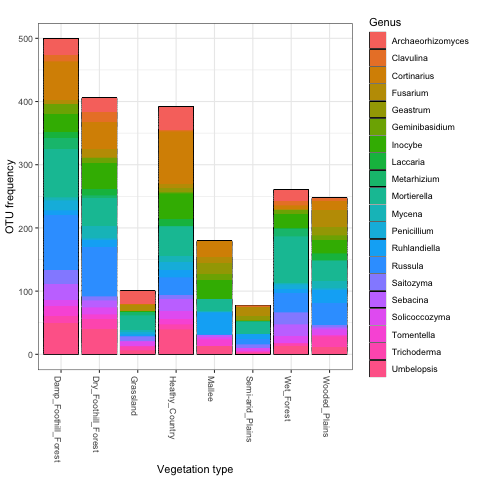
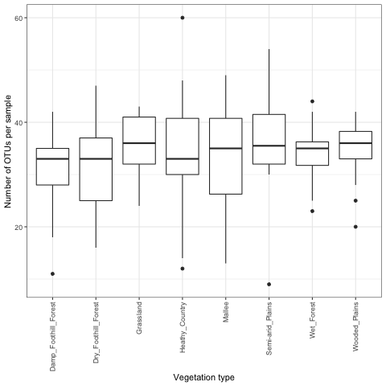
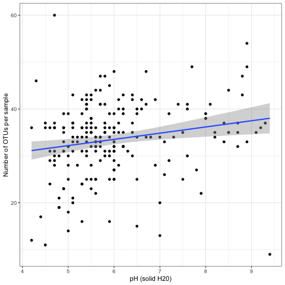

# Goals

We tested for the correlation of fungal species richness (alpha-diversity) and fungal community structure (beta-diversity) with the following [environmental variables](https://github.com/Royal-Botanic-Gardens-Victoria/VicMicrobiome/blob/main/data/VicMicrobiome_metadata.csv):

- Vegetation type
- Vegetation state
- Dominant grasses (%)
- Dominant trees (%)
- Soil depth
- Soil pH (solid in water)
- Organic carbon (%)
- Clay (%)
- Gravel (%)
- Sand (%)

The following variables were omitted because they contained too many missing data:
- Silt (%)
- Ammonium nitrogen (mg/kg)
- Nitrate nitrogen (mg/kg)
- Phosphorus (mg/kg, Colwell)

# Species richness

According to our dataset, the [most frequent fungal genera](https://github.com/Royal-Botanic-Gardens-Victoria/VicMicrobiome/blob/main/output/ITS/20_most_frequent_genera.csv) in Victorian soils are saprophytic taxa from the genus *Mortierella*, followed by ectomycorrhizal species in the genera *Russula*, *Cortinarius* and *Inocybe*.
Additionally, the following species were among the [most frequent fungal species](https://github.com/Royal-Botanic-Gardens-Victoria/VicMicrobiome/blob/main/output/ITS/50_most_frequent_OTUs.csv) as well as the [most abundant fungal species](https://github.com/Royal-Botanic-Gardens-Victoria/VicMicrobiome/blob/main/output/ITS/50_most_abundant_OTUs.csv) that we detected:

- *Umbelopsis dimorpha* (endophytic)
- *Fusarium oxysporum* (parasitic)
- *Saitozyma podzolica* (yeast)
- *Mortierella elongata* (saprophytic)
- *Mortierella humilis* (saprophytic)

As expected, Ascomycota and Basidiomycota were the most species-rich fungal phyla across all the vegetation types sampled (Fig. 1).

**FIGURE 1. OTU frequency of each phylum per vegetation type**

We tested for the correlation of fungal species richness with environmental variables using generalized linear models with a negative binomial distribution.

Despite some differences in the frequency of the [20 most frequent fungal genera](https://github.com/Royal-Botanic-Gardens-Victoria/VicMicrobiome/blob/main/output/ITS/20_most_frequent_genera.csv) between vegetation types (Fig. 2), no significant differences in species richness was found between vegetation types (Fig. 3). Among all the variables tested, the only significant predictor of overall fungal richness was soil pH (Pvalue = 0.003, Fig. 4).

**FIGURE 2. OTU frequency of the top 20 fungal genera per vegetation type**

**FIGURE 3. Species richness per vegetation type**

**FIGURE 4. Correlation of species richness with pH**

# Community composition

We tested for the correlation of fungal community composition with environmental variables by generating
a Raup-Crick distance matrix (based on presence-absence of OTUs occuring in at least two samples) and fitting environmental vectors or factors onto the ordination with the `envfit` function. The ordination was visualized using non-metric multidimensional scaling (NMDS) and colour-coding each sample according to significant environmental predictors.

All the environmental variables listed above correlated significantly with the overall fungal community composition (Pvalue < 0.001), except for soil depth and % gravel (Fig. 5).

**FIGURE 5. NMDS of the overall fungal community composition for each significant environmental variable (Pvalue < 0.001)**

