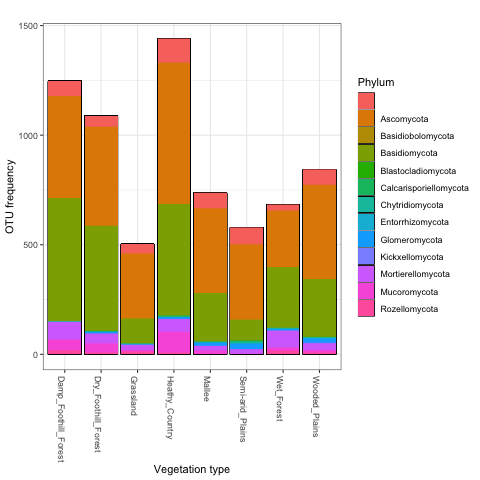

# Goals

We tested for the correlation of species richness (alpha-diversity) and community structure (beta-diversity) with the following [environmental variables](https://github.com/Royal-Botanic-Gardens-Victoria/VicMicrobiome/blob/main/data/VicMicrobiome_metadata.csv):

- Vegetation type
- Vegetation state
- Dominant grasses (%)
- Dominant trees (%)
- Soil depth
- Soil pH (solid in water)
- Organic carbon (%)
- Clay (%)
- Gravel (%)
- Sand (%)

The following variables were omitted because they contained too many missing data:
- Silt (%)
- Ammonium nitrogen (mg/kg)
- Nitrate nitrogen (mg/kg)
- Phosphorus (mg/kg, Colwell)

# Fungi

## Species richness

According to our dataset, the [most frequent fungal genera](https://github.com/Royal-Botanic-Gardens-Victoria/VicMicrobiome/blob/main/output/ITS/20_most_frequent_genera.csv) in Victorian soils are saprophytic taxa from the genus *Mortierella*, followed by ectomycorrhizal species in the genera *Russula*, *Cortinarius* and *Inocybe*.
Additionally, the following species were among the [most frequent fungal species](https://github.com/Royal-Botanic-Gardens-Victoria/VicMicrobiome/blob/main/output/ITS/50_most_frequent_OTUs.csv) as well as the [most abundant fungal species](https://github.com/Royal-Botanic-Gardens-Victoria/VicMicrobiome/blob/main/output/ITS/50_most_abundant_OTUs.csv) that we detected:

- *Umbelopsis dimorpha* (endophytic)
- *Fusarium oxysporum* (plant pathogen)
- *Saitozyma podzolica* (yeast)
- *Mortierella elongata* (saprotrophic)
- *Mortierella humilis* (saprotrophic)

As expected, Ascomycota and Basidiomycota were the most species-rich fungal phyla across the vegetation types sampled (Fig. 1).

**FIGURE 1. OTU frequency of each phylum per vegetation type**

We tested for the correlation of fungal species richness with environmental variables using Chi square tests and generalized linear models with a negative binomial distribution. Despite some differences in the frequency of the [20 most frequent fungal genera](https://github.com/Royal-Botanic-Gardens-Victoria/VicMicrobiome/blob/main/output/ITS/20_most_frequent_genera.csv) between vegetation types (Fig. 2), no significant difference in overall species richness was found between vegetation types (Fig. 3). Among all the variables tested, the only significant predictor of overall fungal richness was soil pH (Pvalue = 0.003, Fig. 4).

**FIGURE 2. OTU frequency of the top 20 fungal genera per vegetation type**

**FIGURE 3. Overall species richness per vegetation type**

**FIGURE 4. Correlation of overall species richness with soil pH**

On the other hand, ectomycorrhizal fungal richness was significantly different (Pvalue < 0.001) between vegetation types (Fig. 5), vegetation states, % gravel and % dominant trees (Fig. 6). Saprophytic fungal richness was significantly different between vegetation types (Fig. 7), while the richness of arbuscular mycorrhizal fungi was only marginally significant between vegetation types, likely due to the low number of OTUs detected. The diversity of plant pathogens was not significantly different between vegetation types, but varied significantly between soil depths (Fig. 8) and vegetation states (Fig. 9).

**FIGURE 5. Ectomycorrhizal species richness per vegetation type**

**FIGURE 6. Correlation of ectomycorrhizal species richness with % dominant trees**

**FIGURE 7. Saprophytic species richness per vegetation type**

**FIGURE 8. Richness of plant pathogens per soil depth**

**FIGURE 9. Richness of plant pathogens per vegetation state**

## Community composition

We tested for the correlation of fungal community composition with environmental variables by generating
a Raup-Crick distance matrix (based on presence-absence of OTUs occuring in at least two samples) and fitting environmental vectors or factors onto the ordination with the `envfit` function. The ordination was visualized using non-metric multidimensional scaling (NMDS) and samples were colour-coded according to significant environmental predictors.

All the environmental variables listed above correlated significantly with the overall, ectomycorrhizal and saprophytic fungal community composition (Pvalue < 0.001), except for soil depth and % gravel (Figs. 10-12).

**FIGURE 10. NMDS of the overall fungal community composition with samples color-coded according to significant environmental variables (Pvalue < 0.001)**

**FIGURE 11. NMDS of the ectomycorrhizal fungal community composition with samples color-coded according to significant environmental variables (Pvalue < 0.001)**

**FIGURE 12. NMDS of the saprophytic fungal community composition with samples color-coded according to significant environmental variables (Pvalue < 0.001)**

# Bacteria

## Species richness

According to our dataset, the [most frequent bacterial species](https://github.com/Royal-Botanic-Gardens-Victoria/VicMicrobiome/blob/main/output/16S/50_most_frequent_OTUs.csv) as well as the [most abundant bacterial species](https://github.com/Royal-Botanic-Gardens-Victoria/VicMicrobiome/blob/main/output/ITS/50_most_abundant_OTUs.csv) belonged to Rhizobiales, Actinomycetales, Solirubrobacterales and Baciliales.
The [most frequent bacterial genera](https://github.com/Royal-Botanic-Gardens-Victoria/VicMicrobiome/blob/main/output/16S/20_most_frequent_genera.csv) in Victorian soils are *Gaiella*, *Mycobacterium*, *Solirubrobacter*, *Bradyrhizobium* and *Pseudonocardia*.

Actinomycetales, Rhizobiales and Rhodospirillales were the most species-rich and frequently detected bacterial orders across the vegetation types sampled (Fig. 13).

**FIGURE 13. OTU frequency of each bacterial order per vegetation type**

We tested for the correlation of bacterial species richness with environmental variables using Chi square tests and generalized linear models with a negative binomial distribution. Significant differences (Pvalue < 0.05) in species richness were found between % organic carbon (Fig. 14), vegetation types (Fig. 15), soil depth and % dominant trees. 

**FIGURE 14. Correlation of species richness with soil organic carbon**

**FIGURE 15. Bacterial species richness per vegetation type**

## Community composition

We tested for the correlation of bacterial community composition with environmental variables by generating
a Raup-Crick distance matrix (based on presence-absence of OTUs occuring in at least two samples) and fitting environmental vectors or factors onto the ordination with the `envfit` function. The ordination was visualized using non-metric multidimensional scaling (NMDS) and samples were colour-coded according to significant environmental predictors.

All the environmental variables listed above correlated significantly with the bacterial community composition (Pvalue < 0.03), except for % gravel (Fig. 16).

**FIGURE 16. NMDS of the bacterial community composition with samples color-coded according to significant environmental variables (Pvalue < 0.03)**

