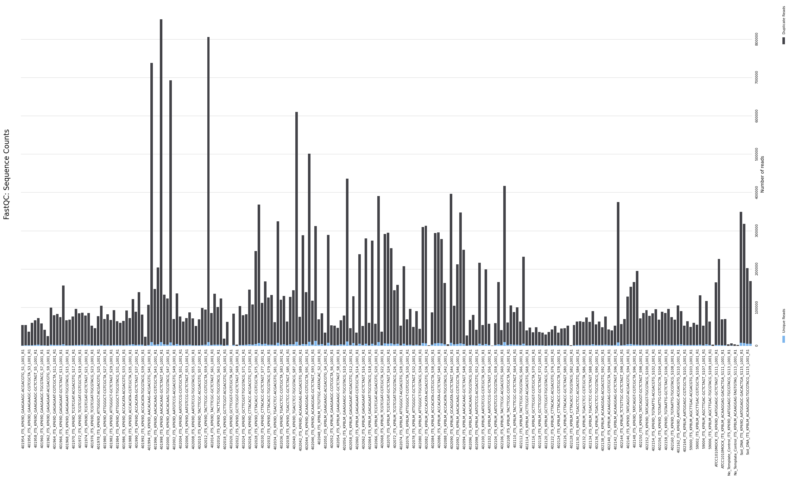
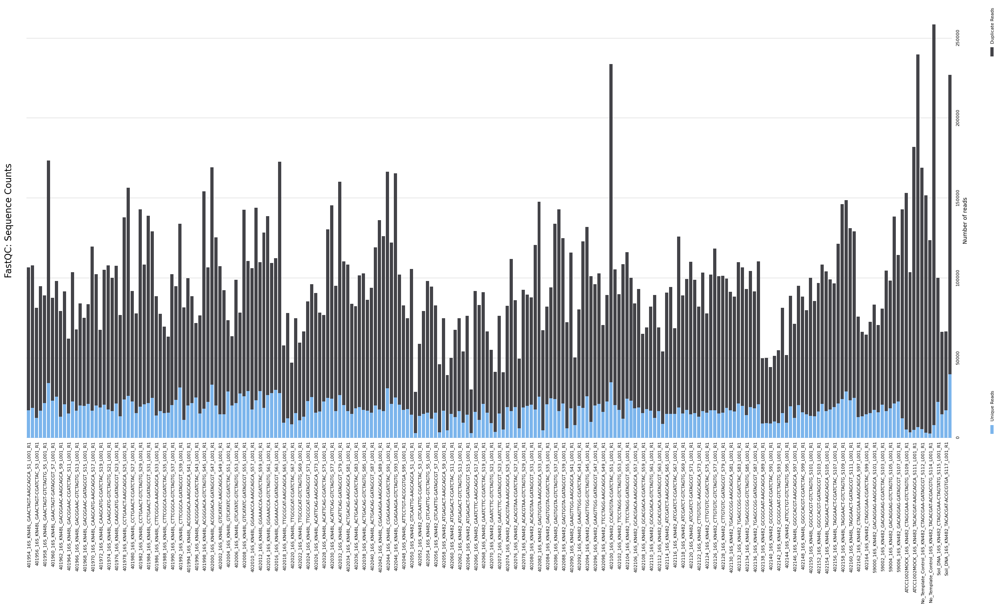
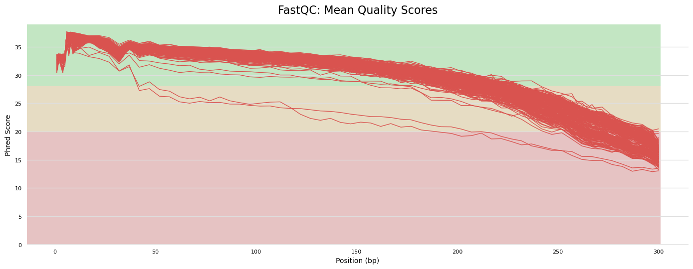
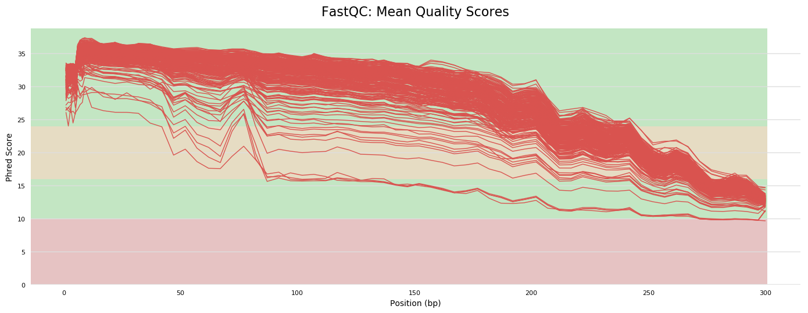

# Sequence quality

The number of reads varied greatly between samples, both for ITS (fungi) and 16S (bacteria). This is likely to induce biases against rare taxa in the samples with fewer reads.

**MultiQC plot of the number of ITS forward reads per sample (fungi)**

**MultiQC plot of the number of 16S forward reads per sample (bacteria)**

The quality of ITS reads (fungi) was below the 1% error rate (*Phred score = 20**) towards the last ca. 50 bp of the sequences. This was especially relevant for reverse (R2) reads and is likely to preclude the merging of R1 and R2 reads.

**MultiQC plot of the quality score (Phred) per base call along ITS reverse reads (fungi)**

The quality of 16S reads (bacteria) was below the 1% error rate for up to 2/3 of the read lenght for a proportion of the data. This is likely to induce large data loss in order to obtain robust diversity assumptions.

**MultiQC plot of the quality score (Phred) per base call along 16S reverse reads (bacteria)**

**Phred score = 20: likelihood of finding 1 incorrect base call among 100 bases.*

# Suggestions 

Improve sequence quality
- Generate amplicons with a size that corresponds to the sequence fragment (ITS1 or ITS2) so that reads can be merged acurately
- Bench work (equimolar concentrations between samples, spike-in?)

Reduce index bleed
- Do not allow any error when reading the barcode during demultiplexing